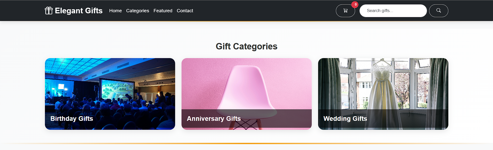
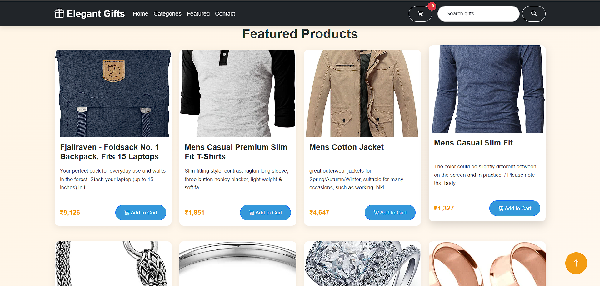
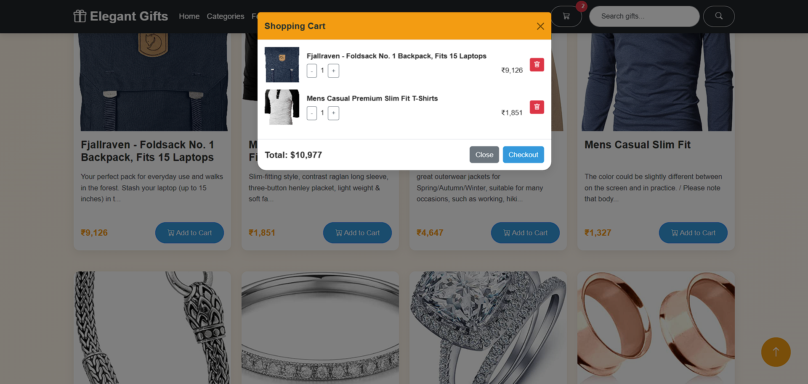
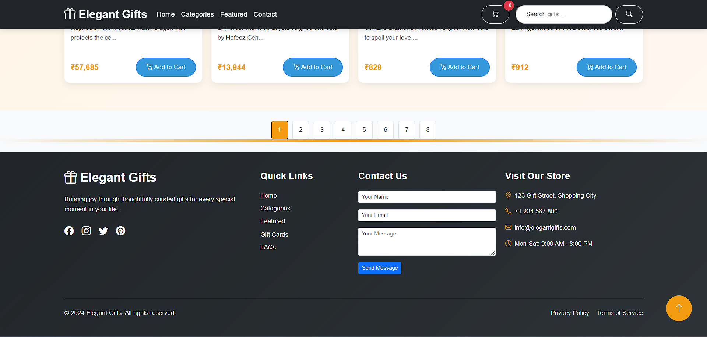

# Elegant Gifts Website

A dynamic e-commerce website built with jQuery, featuring a modern interface for an elegant gift shop experience.

## 📸 Screenshots

### Home Page

*Elegant landing page with hero section and featured products*

### Categories Section

*Browse gifts by categories with interactive cards*

### Featured Products

*Curated selection of premium gifts with detailed product cards*

### Shopping Cart

*Dynamic cart management with real-time updates*

### Contact Form

*Responsive contact form with validation*

## 🚀 Features

### Core Functionality
- **Shopping Cart System**: Dynamic cart management with real-time updates
- **Product Filtering**: Category-based product filtering
- **Responsive Design**: Mobile-first approach for all screen sizes
- **Animated Elements**: Smooth transitions and animations using jQuery and Animate.css
- **Form Validation**: Client-side validation for contact forms
- **Modal Dialogs**: Interactive popups for cart and product details

### User Interface
- **Fixed Navigation**: Sticky navbar with smooth scroll functionality
- **Dynamic Cart Counter**: Real-time cart item count updates
- **Back to Top Button**: Appears when scrolling down
- **Loading Animations**: Smooth loading transitions between actions
- **Interactive Cards**: Hover effects and click animations
- **Responsive Images**: Optimized for different screen sizes

## 🛠️ Technical Stack

### Core Technologies
- **jQuery 3.7.1**: Main JavaScript framework
- **Bootstrap 5.3.3**: Frontend framework
- **HTML5**: Structure
- **CSS3**: Styling
- **JavaScript**: Client-side scripting

### Dependencies
```json
{
  "jquery": "^3.7.1",
  "bootstrap": "^5.3.3",
  "bootstrap-icons": "^1.11.3",
  "animate.css": "^4.1.1"
}
```

## 📁 Project Structure

```
elegant-gifts/
│
├── index.html          # Main HTML file
├── style.css          # Custom styles
├── script.js          # jQuery/JavaScript code
├── README.md          # Project documentation
└── assets/           # Images and other static files
```
## 🌟 Key Features

- **Product Management**
  - Dynamic product catalog with filtering
  - Real-time inventory tracking
  - Product search functionality
  - Detailed product views with images

- **Shopping Experience** 
  - Intuitive shopping cart system
  - Smooth checkout process
  - Order history tracking
  - Wishlist functionality

- **User Interface**
  - Modern responsive design
  - Interactive product cards
  - Animated transitions
  - Mobile-optimized layout

- **Security & Performance**
  - Form validation and sanitization
  - Optimized image loading
  - Smooth scrolling and navigation
  - Error handling and feedback


## 🚦 Getting Started

### Prerequisites
- Modern web browser
- Local development server (recommended)

### Installation
1. Clone the repository:
```bash
git clone https://github.com/Jeyasurya23/gift-jquery.git
```

2. Navigate to project directory:
```bash
cd elegant-gifts
```

3. Open `index.html` in your browser or set up a local server

### Development Setup
1. Install a local server (optional):
```bash
npm install -g live-server
```

2. Run the server:
```bash
live-server
```

## 💻 Usage

### Running the Project
- Open `index.html` directly in a browser
- Or use a local development server
- Access through `http://localhost:8080` (if using live-server)

### Making Changes
1. Edit HTML/CSS/JS files
2. Refresh browser to see changes
3. Use browser dev tools for debugging

## 🤝 Contributing

1. Fork the repository
2. Create your feature branch (`git checkout -b feature/AmazingFeature`)
3. Commit changes (`git commit -m 'Add AmazingFeature'`)
4. Push to branch (`git push origin feature/AmazingFeature`)
5. Open a Pull Request

## 📝 License

This project is licensed under the MIT License - see the [LICENSE](LICENSE) file for details.

## 📞 Contact

- GitHub: [Jeyasurya23](https://github.com/Jeyasurya23)
- Email: jeyasurya0100@gmail.com 
- Issue Tracker: [GitHub Issues](https://github.com/Jeyasurya23/gift-jquery/issues)

## 🔄 Updates and Maintenance

- Regular updates for security patches
- Monthly feature additions
- Continuous performance optimization
- Browser compatibility updates

## 🌟 Acknowledgments

- jQuery Team for the amazing framework
- Bootstrap Team for the responsive framework
- All contributors and supporters
